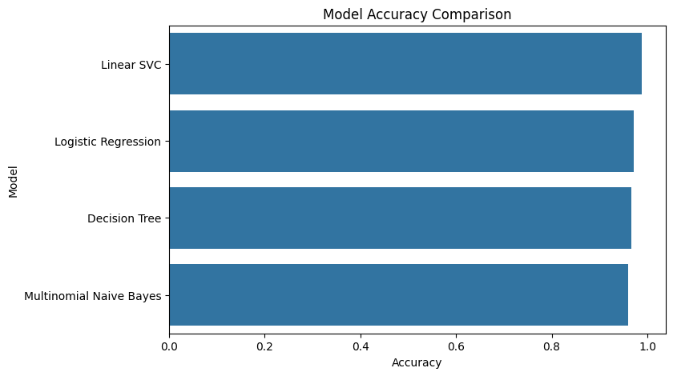
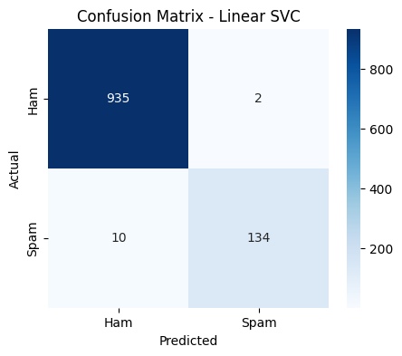

# 📩 SMS Spam Classifier using Machine Learning

## 📌 Project Overview

This project demonstrates how Machine Learning can be used to automatically classify SMS messages as **Spam** or **Ham (Not Spam)**.

The notebook covers the complete machine learning workflow, including:

- Data loading
- Data cleaning
- Text preprocessing using TF-IDF
- Model training
- Model evaluation
- Performance comparison

---

## 🛠 Technologies Used

- Python
- Pandas
- NumPy
- Scikit-learn
- Matplotlib
- Seaborn
- Jupyter Notebook

---

## 🤖 Machine Learning Models

The following models were trained and compared:

- Logistic Regression
- Multinomial Naive Bayes
- Decision Tree
- Linear Support Vector Classifier (Linear SVC)

---

## 📊 Evaluation Metrics

Each model was evaluated using:

- Accuracy
- Precision
- Recall
- F1-Score
- Confusion Matrix

A final comparison chart was created to compare the accuracy of all models.

## 📈 Model Accuracy Comparison

<p align="center">
  
</p>

---

## 🔥 Confusion Matrix (Linear SVC)

<p align="center">
  
</p>

---

## 📂 Project Structure


spam-classifier-machine-learning/
│
├── spam_model_evaluation.ipynb
├── messages.csv
├── model_accuracy_comparision.png
├── Confusion_Matrix_Linear-SVC.png
├── README.md
├── LICENSE
└── .gitignore
```


---

## 🚀 How to Run

1. Clone the repository

```
git clone https://github.com/ErvinAjdinovic/spam-classifier-machine-learning.git
```

2. Install the required libraries

```
pip install pandas numpy matplotlib seaborn scikit-learn
```

3. Open the notebook

```
jupyter notebook
```

4. Run all notebook cells.

---

## 👨‍💻 Author

**Ervin Ajdinovic**

Python • Machine Learning • Data Analysis
